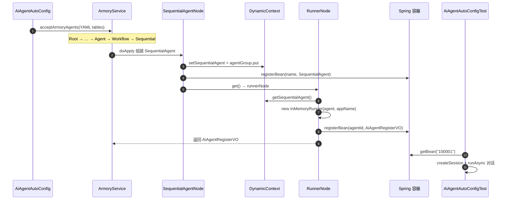

# 装配域节点 RunnerNode 学习笔记

> 对应课程：第 2-10 节 · 装配域节点-RunnerNode（验证测试对照第 2-11 节）  
> 工程分支：`2-10-runnerNode`  
> 对照学习项目分支：`2-10-armory-node-runner` / 测试对照 `2-11-armory-config-yml`

---

> 学习笔记写法约定见工作台：`D:\javaproject\docs\学习笔记撰写约定.md`（结构：流程理解 + UML → 细聊 / 踩坑 / 拓展）

---

## 一、流程理解（总览）

前几节已把 API → ChatModel → 多个 `LlmAgent` → 工作流（Loop/Parallel/`SequentialAgent`）装好。  
本节把「装好的智能体」接到「能对话」：用 `InMemoryRunner` 包住最后的 `SequentialAgent`，再以 `AiAgentRegisterVO` 按 `agentId` 注册进 Spring。

1. **启动时触发自动装配**  
   入口：`AiAgentAutoConfig.onApplicationEvent`（`ApplicationReadyEvent`）。读取 `ai.agent.config.tables`（如 `agent/test-agent.yml`），调用 `IArmoryService.acceptArmoryAgents(...)`。

2. **装配链跑到 SequentialAgentNode**  
   `RootNode` → … → `AgentNode` → `AgentWorkflowNode` →（Loop/Parallel 互跳后）`SequentialAgentNode`。  
   `SequentialAgentNode.doApply`：按工作流配置组装 `SequentialAgent`，写入 `agentGroup`，并 **`dynamicContext.setSequentialAgent(...)`**，再 `registerBean` 注册该 Agent。

3. **流转到 RunnerNode**  
   `SequentialAgentNode.get()` 返回注入的 `runnerNode`（不再是链终点）。

4. **RunnerNode：构建会话运行器并注册结果 VO**  
   入口：`RunnerNode.doApply`。从配置取 `appName` / `agentId` / `agentName` / `agentDesc`；从上下文取 `SequentialAgent`；`new InMemoryRunner(sequentialAgent, appName)`；组装 `AiAgentRegisterVO`；**`registerBean(agentId, AiAgentRegisterVO.class, vo)`**。  
   `get()` 返回 `defaultStrategyHandler`，装配链在此结束。

5. **端到端对话验证（2-11 测试）**  
   `AiAgentAutoConfigTest`：`applicationContext.getBean("100001", AiAgentRegisterVO.class)` → 取 `runner` → 建 Session → `runAsync("编写冒泡排序")` → 收集事件日志。

一句话：**`InMemoryRunner` 不是把 Agent「存盘」，而是用内存 Session 跑已装配的 Agent；`agentId` 是后续从容器取对话能力的钥匙。**

### 时序图（UML）



**文本版（对照上面编号）：**

```text
AiAgentAutoConfig
  ① 启动就绪 → acceptArmoryAgents
装配链
  ② … → SequentialAgentNode：组装 SequentialAgent，写入上下文
  ③ get → RunnerNode
  ④ RunnerNode：InMemoryRunner + AiAgentRegisterVO 按 agentId 注册
验证
  ⑤ AiAgentAutoConfigTest：按 agentId 取 VO，真实对话
```

---

## 二、学习内容与代码对应

| 文件 | 作用 |
|------|------|
| `…/armory/node/RunnerNode.java` | 建 `InMemoryRunner`，注册 `AiAgentRegisterVO` |
| `…/workflow/SequentialAgentNode.java` | `setSequentialAgent`；`get()` → `runnerNode` |
| `…/factory/DefaultArmoryFactory.DynamicContext` | 字段 `sequentialAgent` |
| `…/valobj/AiAgentRegisterVO.java` | `appName` / `agentId` / `agentName` / `agentDesc` / `runner` |
| `…/config/AiAgentAutoConfig.java` | 启动后调用装配 |
| `…/test/app/AiAgentAutoConfigTest.java` | 按 `100001` 取 Bean 并对话 |
| `resources/agent/test-agent.yml` | `agent-id: 100001` 等配置 |

**关键约定：**

- Bean 名 = YAML `agent.agent-id`（测试里写死 `"100001"`）
- 当前 Runner 只包「最后写入的」`SequentialAgent`；任意 Agent 进 Runner 是后续增强

---

## 三、踩坑注意点

1. **装配未跑通就 getBean**  
   若 `AgentNode` 未接到 `AgentWorkflowNode`，或 AutoConfig 未调 `acceptArmoryAgents`，容器里没有 `100001`，测试直接失败。

2. **`InMemoryRunner` 含义易混**  
   InMemory 指 **Session 存在进程内存**，进程结束即丢；不是把 Agent 定义持久化。

3. **测试末尾 `CountDownLatch(1).await()`**  
   会一直挂起，方便看日志；CI/自动化需去掉或改成有超时的等待。

4. **密钥与 MCP**  
   `test-agent.yml` 里 API Key / MCP 需本地可用，否则装配或对话阶段报错。

---

## 四、拓展知识

| 概念 | 说明 |
|------|------|
| 早前 `SequentialAgentTest` | 测试里手写 Agent + `new InMemoryRunner` |
| 本节测试 | 配置驱动装配后，只从容器取 `runner` |
| `registerBean` | 运行时动态挂单例；同名先删后注册，支持重复装配覆盖 |

**自测清单：**

- [ ] 启动日志出现「Ai Agent 智能体装配」且无异常  
- [ ] 日志有 `RunnerNode` /「成功注册Bean: 100001」  
- [ ] `AiAgentAutoConfigTest` 能拿到 Bean 并打出对话结果  
