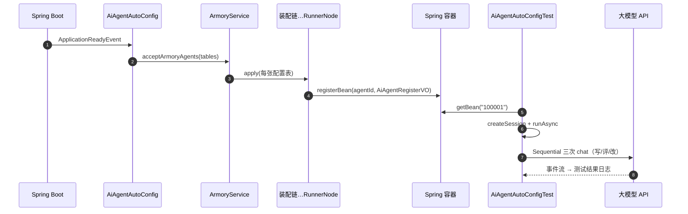

# 智能体加载使用验证学习笔记

> 对应课程：第 2-11 节 · 智能体加载使用验证  
> 工程分支：`2-11-armory-verify`（承接 2-10 RunnerNode）  
> 对照学习项目分支：`2-11-armory-config-yml`

---

> 学习笔记写法约定见工作台：`D:\javaproject\docs\学习笔记撰写约定.md`（结构：流程理解 + UML → 细聊 / 踩坑 / 拓展）

---

## 一、流程理解（总览）

2-10 已能把 `SequentialAgent` 装进 `InMemoryRunner` 并按 `agentId` 注册。  
本节验证：**应用启动自动装配 → 测试从容器取 Runner → 真实对话出结果**。

1. **启动加载配置并触发装配**  
   `AiAgentAutoConfig` 监听 `ApplicationReadyEvent`，读 `ai.agent.config.tables`（`agent/test-agent.yml`），调用 `ArmoryService.acceptArmoryAgents`。

2. **每张配置表跑完整装配链**  
   `ArmoryService` 对每个 table：`RootNode` → `AiApi` → `ChatModel` → `Agent` → `AgentWorkflow` → `Sequential` → `RunnerNode`，最后注册 `AiAgentRegisterVO`（Bean 名 = `agent-id`，如 `100001`）。

3. **测试按 agentId 取对话能力**  
   `AiAgentAutoConfigTest`：`getBean("100001")` → `getRunner()` → `createSession` → `runAsync("编写冒泡排序")`。

4. **Sequential 子 Agent 串行出结果**  
   写代码 → 评审 → 重构：三次 LLM 调用；子 Agent 靠 `output-key` / 会话状态接力（`generated_code` 等），不是互相 RPC。

一句话：**装配正确的标志是容器里有 `agentId` 对应的 VO；验证成功的标志是 Runner 能打出三段流水线输出。**

### 时序图（UML）



**文本版：**

```text
① 启动 → AiAgentAutoConfig 读 YAML
② ArmoryService 逐表装配 → 注册 100001
③ 测试 getBean → InMemoryRunner 对话
④ Sequential 子 Agent 串行调模型，收集 outputs
```

---

## 二、学习内容与代码对应

| 文件 | 作用 |
|------|------|
| `config/AiAgentAutoConfig.java` | 就绪后触发装配 |
| `ArmoryService.java` | 多 table 循环进规则树 |
| `AiAgentAutoConfigProperties.java` | `ai.agent.config.tables` |
| `test/app/AiAgentAutoConfigTest.java` | 端到端对话验证 |
| `agent/test-agent.yml` | `agent-id: 100001` 与流水线配置 |

**成功日志特征：**

- `成功注册Bean: CodePipelineAgent` / `成功注册Bean: 100001`
- 多次 `Request completed successfully`
- `测试结果:[写代码, 评审意见, 重构代码]`

---

## 三、踩坑注意点

1. **`baseUrl` + `completionsPath` 叠 `/v1` → 404**  
   阿里云 `…/compatible-mode/v1` 应配 `completions-path: /chat/completions`。  
   **留空会回退默认 `v1/chat/completions`，仍会拼成双 v1。**

2. **装配成功 ≠ 对话成功**  
   Bean 已注册仍可能在 `chatCompletionEntity` 404/鉴权失败。

3. **`CountDownLatch(1).await()`**  
   故意挂起看日志；IDEA 需手动停，不是断言失败。

4. **密钥勿入库**  
   本地 `api-key` / MCP key 只放本机；日志会打印配置，注意脱敏与轮换。

5. **Sequential 体感慢**  
   串行多次 LLM，耗时近似相加；教学演示用，线上可减跳数/并行/流式。

---

## 四、拓展知识

| 概念 | 说明 |
|------|------|
| 一个 `agent-id` | 一个主入口 / 一个 Runner |
| 入口内多个 `agents` + workflow | 该入口下的多 Agent 协作 |
| `tables` 多项 | 应用内多个主入口，默认互不通信，业务层编排 |

**自测清单：**

- [ ] 启动无装配异常，Bean `100001` 存在  
- [ ] 测试能打出非空 `测试结果`  
- [ ] 换厂商时核对 baseUrl 与 completions-path 拼接  
