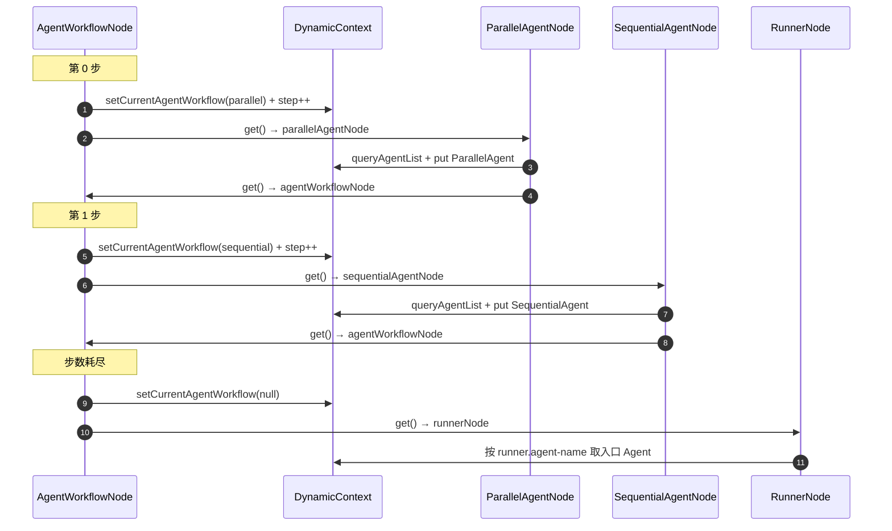

# 增强装配 AgentWorkflowNode 学习笔记

> 对应课程：第 2-13 节 · 增强装配-AgentWorkflowNode  
> 工程分支：`2-13-enhance-workflowNode`  
> 对照学习项目分支：`2-13-enhance-armory-agent-work-flow`

---

> 学习笔记写法约定见工作台：`D:\javaproject\docs\学习笔记撰写约定.md`（结构：流程理解 + UML → 细聊 / 踩坑 / 拓展）

---

## 一、流程理解（总览）

旧版里 Loop / Parallel / Sequential 各自在 `get()` 里看列表首项、兄弟互跳。  
本节改成**星型分发**：`AgentWorkflowNode` 统一推进步骤并决定下一跳；三个子节点只负责组装，装完一律回到中心。

1. **装配链进入 AgentWorkflowNode**  
   入口：`AgentWorkflowNode.doApply`。从 YAML 读 `module.agent-workflows`；用 `currentStepIndex` 取第 N 项，写入 `currentAgentWorkflow`，再 `addCurrentStepIndex()`。若列表空或已装完，置 `currentAgentWorkflow = null`。

2. **中心按 type 分发**  
   `AgentWorkflowNode.get()`：当前项为 null → `RunnerNode`；否则按 `AgentTypeEnum` 返回 `LoopAgentNode` / `ParallelAgentNode` / `SequentialAgentNode`。

3. **子节点只装配，不决策**  
   入口：各子节点 `doApply`。读 `getCurrentAgentWorkflow()`（不再 `remove(0)`）→ `queryAgentList(subAgents)` → builder → `agentGroup.put`。  
   `get()` 固定 `getBean("agentWorkflowNode")`，回到步骤 1。

4. **多段 workflow 反复回中心**  
   例：`parallel_research_app.yml` 先装 Parallel，再回中心装 Sequential，再回中心发现步数耗尽 → Runner。

5. **Runner 按名取入口并注册**  
   `RunnerNode` 用 `runner.agent-name`（如 `ResearchAndSynthesisPipeline`）从 `agentGroup` 取 Agent，构建 `InMemoryRunner`，按 `agent-id`（`100002`）注册。

6. **测试验证**  
   `AiAgentAutoConfigTest.test_handlerMessage_02`：`getBean("100002")` → 问「你具备哪些能力」→ 收集并行研究 + 汇总输出。

一句话：**跳转规则收口到 AgentWorkflowNode；子节点只装 Agent；拓扑顺序仍靠 YAML 人手保证。**

### 时序图（UML）



**文本版（对照上面编号）：**

```text
AgentWorkflowNode（分发中心）
  ① doApply：按 currentStepIndex 写入 currentAgentWorkflow
  ② get：按 type 分发 / null 则 Runner
子节点 Loop / Parallel / Sequential
  ③ doApply：只读当前配置并装配
  ④ get：固定回到 AgentWorkflowNode
收尾
  ⑤ 全部装完 → RunnerNode → Bean agentId
```

---

## 二、学习内容与代码对应

| 文件 | 作用 |
|------|------|
| `…/factory/DefaultArmoryFactory.DynamicContext` | `currentAgentWorkflow` + `currentStepIndex`（替代列表 remove 消费） |
| `…/node/AgentWorkflowNode.java` | 星型分发：推进步骤 + 按 type 路由 |
| `…/workflow/LoopAgentNode.java` | 组装 LoopAgent；`get` → 回中心 |
| `…/workflow/ParallelAgentNode.java` | 组装 ParallelAgent；`get` → 回中心 |
| `…/workflow/SequentialAgentNode.java` | 组装 SequentialAgent；`get` → 回中心（不再直跳 Runner） |
| `resources/agent/parallel_research_app.yml` | `100002`：parallel → sequential 两段 workflow |
| `application-dev.yml` | 引入 `parallel_research_app.yml` |
| `…/test/app/AiAgentAutoConfigTest.java` | `test_handlerMessage_02` 验证 `100002` |

**旧版 → 新版对照：**

| | 旧版（互跳） | 新版（星型） |
|--|--|--|
| 上下文 | `agentWorkflows` 列表，`remove(0)` | `currentStepIndex` + `currentAgentWorkflow` |
| 流转决策 | 三个子节点各自 `get()` | 仅 `AgentWorkflowNode.get()` |
| 子节点 `get()` | switch 互跳 | 固定回 `agentWorkflowNode` |

---

## 三、踩坑注意点

1. **拓扑顺序问题并未消失**  
   `queryAgentList` 仍只查已有 `agentGroup`，缺则静默跳过。YAML 里被引用的 workflow / Agent 仍须先写。星型只解决「谁跳」，不解决「依赖解析」。

2. **步数判断用 `>= size`，不要和 `== size` 混用**  
   `currentStepIndex` 是「下一待取下标」；装完最后一项后 index == size，应走「清空 → Runner」。

3. **子节点不要再写互跳逻辑**  
   若 Loop/Parallel 仍保留旧版 `switch`，会和中心分发打架。统一 `getBean("agentWorkflowNode")`。

4. **`getBean` 仍有必要**  
   子节点回中心若用 `@Resource AgentWorkflowNode`，与中心注入子节点形成循环依赖；运行时 `getBean` 可拆开。

5. **验证配置要对上 agent-id**  
   `parallel_research_app` → Bean `100002`；与 `test-agent` 的 `100001`、`only-one-agent` 的 `100003` 区分开。

---

## 四、拓展知识

### 4.1 为什么用星型而不是继续互跳

跳转规则从三处收到一处：职责清晰、加类型主要改中心、结束条件（进 Runner）也单点处理。装配期多回跳一次几乎无成本。

### 4.2 仍可继续增强的方向

- 装配前对 `agent-workflows` 做拓扑排序  
- `queryAgentList` 发现缺失时按 name 递归先装对应 workflow  

### 4.3 自测清单

- [ ] DynamicContext 已改为 step + current，不再依赖列表 remove  
- [ ] AgentWorkflowNode 负责推进与分发  
- [ ] 三个子节点 `get()` 均回 `agentWorkflowNode`  
- [ ] `parallel_research_app.yml` 已挂到 `application-dev.yml`  
- [ ] `test_handlerMessage_02` 能取到 `100002` 并出并行汇总结果  
- [ ] 能讲清：星型 ≠ 自动解拓扑依赖  
