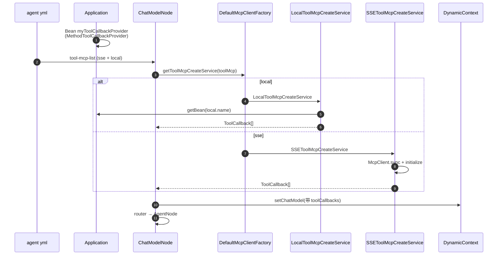

# 增强装配-本地 MCP 学习笔记

> 对应课程：第 2-14 节 · 增强装配-本地 mcp  
> 工程分支：`2-14-enhance-mcp-strategy`  
> 对照学习项目分支：`2-14-enhance-armory-mcp-strategy`

---

> 学习笔记写法约定见工作台：`D:\javaproject\docs\学习笔记撰写约定.md`（结构：流程理解 + UML → 细聊 / 踩坑 / 拓展）

---

## 一、流程理解（总览）

旧版 `ChatModelNode` 用 if/else 直连 SSE / Stdio 建 `McpSyncClient`。  
本节拆成**工厂 + 策略**：节点只汇总 `ToolCallback`；并新增 **local**（进程内 `@Tool` Bean），便于扩展自定义工具。

1. **YAML 声明工具来源**  
   入口：`agent/*.yml` → `module.chat-model.tool-mcp-list`。  
   每条配置三选一：`sse` / `stdio` / `local`（`local.name` = 容器中 `ToolCallbackProvider` 的 bean 名，如 `myToolCallbackProvider`）。

2. **本地样例工具注册进 Spring**  
   入口：`Application#testTools`（`@Bean("myToolCallbackProvider")`）。  
   `MethodToolCallbackProvider` 扫描 `MyTestMcpService` 上的 `@Tool`，打成工具包。

3. **ChatModelNode 遍历配置并走工厂**  
   入口：`ChatModelNode#doApply`。对每个 `ToolMcp` 调用  
   `DefaultMcpClientFactory#getToolMcpCreateService` → `ToolMcpCreateService#buildToolCallback`，汇总进 `toolCallbackList`。

4. **策略按类型产出 ToolCallback**  
   - `LocalToolMcpCreateService`：`getBean(name)` → `ToolCallbackProvider.getToolCallbacks()`（无 MCP 握手）  
   - `SSEToolMcpCreateService` / `StdioToolMcpCreateService`：建 `McpSyncClient` → `initialize` → `SyncMcpToolCallbackProvider`

5. **挂到 ChatModel 并继续装配链**  
   `OpenAiChatModel` + `toolCallbacks` 写入 `DynamicContext`，再路由 `AgentNode` → … → `RunnerNode` 注册。

6. **运行时模型按 tool 名调工具**  
   对话时模型根据 schema 选 tool（含本地 `toUpperCase` 与远程 MCP tools），参数走各自约定结构。

一句话：**装配出口统一成 ToolCallback；local 是进程内工具包，sse/stdio 是真 MCP 客户端；扩新传输只加策略。**

### 时序图（UML）



**文本版（对照上面编号）：**

```text
① yml 声明 sse / stdio / local
② Application 注册本地 ToolCallbackProvider
③ ChatModelNode 遍历 tool-mcp-list
④ 工厂选策略 → buildToolCallback
⑤ 汇总挂到 OpenAiChatModel → 继续装配链
⑥ 运行时按 tool 名调用（含本地 @Tool）
```

---

## 二、学习内容与代码对应

| 文件 | 作用 |
|------|------|
| `…/valobj/AiAgentConfigTableVO.ToolMcp` | 增加 `local`（`LocalParameters.name`） |
| `…/mcp/client/ToolMcpCreateService` | 策略接口：`buildToolCallback` |
| `…/mcp/client/factory/DefaultMcpClientFactory` | local → sse → stdio 路由 |
| `…/mcp/client/imp/LocalToolMcpCreateService` | 按 bean 名取本地工具包 |
| `…/mcp/client/imp/SSEToolMcpCreateService` | 原 SSE 逻辑迁出 |
| `…/mcp/client/imp/StdioToolMcpCreateService` | 原 Stdio 逻辑迁出 |
| `…/mcp/server/MyTestMcpService` | `@Tool` 样例（入参/出参 + Jackson 描述） |
| `Application.java` | `@Bean("myToolCallbackProvider")` |
| `…/node/ChatModelNode.java` | 去掉巨型 if/else，只调工厂 |
| `types/.../ResponseCode.NOT_FOUND_METHOD` | 配置类型无法识别时抛出 |
| `resources/agent/only-one-agent.yml` | `tool-mcp-list` 同时挂 sse + local |

**local 与真 MCP 对照：**

| | local | sse / stdio |
|--|--|--|
| 本质 | 本进程 Spring AI `@Tool` | MCP 协议客户端 |
| 配置 | bean 名 | URI / 命令行等 |
| 握手 | 无 | `initialize` |
| 出口 | 都是 `ToolCallback[]` | 同左 |

**与学习项目差异（不影响功能）：** 接口名我方用正确拼写 `ToolMcpCreateService`（学习版 `TooMcp*` 笔误）；实现包目录为 `imp`（学习版 `impl`）。

---

## 三、踩坑注意点

1. **local 不是对外 MCP Server**  
   它只给本 JVM 的 Agent 用；要对别人提供 MCP，需另起 SSE/Streamable 等协议 Server。

2. **bean 名必须对上**  
   yml `local.name` 与 `@Bean("...")` 不一致会 `NoSuchBeanDefinitionException`。

3. **一条 ToolMcp 只配一种类型**  
   工厂按 local → sse → stdio 短路；同条里多写只认优先级最高的那个。

4. **密钥与 skip-worktree**  
   `only-one-agent.yml` / `test-agent.yml` 本地密钥用 `skip-worktree` 隔离；提交结构变更时勿把真实 key 打进 remote。

5. **ChatModelNode 勿再堆传输细节**  
   新传输方式应新增策略类，而不是把逻辑写回节点。

---

## 四、拓展知识

### 1. 后续计划：增加 Streamable Http 策略

与 local 不同，Streamable-HTTP 是 **MCP 传输层**（规范侧演进/替代旧 SSE）。扩展方式与本节同构：

1. `ToolMcp` 增加 `streamable`（或 `streamableHttp`）字段：`baseUri` / `endpoint`（常见 `/mcp`）/ `requestTimeout` / 鉴权头等  
2. 新增 `StreamableHttpToolMcpCreateService`：用 Streamable-HTTP Client Transport 建 `McpClient` → `initialize` → `SyncMcpToolCallbackProvider`  
3. `DefaultMcpClientFactory` 增加分支（建议优先级写清，例如 local → streamable → sse → stdio）  
4. yml `tool-mcp-list` 增加对应项即可  

**不必改** `ChatModelNode` 主流程；也**不要**把 streamable 塞进 local。

厂商对接注意：协议调用方式大体固定，但 endpoint、鉴权、会话头各家可能不同，应做成可配置项。

### 2. 一个 MCP / 工具包里可以有多个 tool

- local：同一 `MyTestMcpService`（或同一 Provider）上多个 `@Tool` 方法 = 多个 tool，参数各自一套 schema  
- 远程 MCP：一个 Server 的 `tools/list` 可返回多个 tool；调用方按 **tool 名** + 该 tool 的 arguments 调用  

### 3. 自测清单

- [ ] 启动后日志出现 `tool local mcp initialize myToolCallbackProvider`  
- [ ] `only-one-agent`（如 agent-id `100003`）对话能用到本地工具或远程搜索  
- [ ] 去掉 local 配置后仍可仅用 sse 装配  
- [ ] 工厂在三种配置皆空时抛出 `NOT_FOUND_METHOD`  
