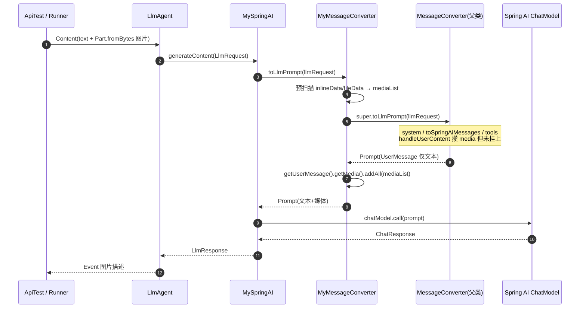

# 修复多模态识图补丁学习笔记

> 对应课程：第 2-16 节 · fix-多模态能力使用  
> 对照学习项目分支：`2-16-fix-spring-ai-mime-type`  
> 说明：本节以**纠错过程学习**为主；上游 Google ADK 已在 **1.1.0** 修复该问题，跟学可不落地改代码。

---

> 学习笔记写法约定见工作台：`D:\javaproject\docs\学习笔记撰写约定.md`（结构：流程理解 + UML → 细聊 / 踩坑 / 拓展）

---

## 一、流程理解（总览）

现象：直接用 Spring AI `ChatModel` + `UserMessage.media` 能识图；同一张图经 Google ADK `LlmAgent` + `SpringAI` 适配层后，模型只收到文字、看不到图。

1. **调用方构造多模态 Content**  
   入口（学习项目）：`ApiTest#main` / `AiAgentAutoConfigTest#test_handlerMessage_03`。  
   `Content.fromParts(Part.fromText(...), Part.fromBytes(图片字节, image/png))`，经 `InMemoryRunner.runAsync` 交给 Agent。

2. **ADK 走到 Spring AI 适配器**  
   `LlmAgent` 的 model 为 `SpringAI`（或补丁版 `MySpringAI`）→ `generateContent` → `messageConverter.toLlmPrompt(llmRequest)`，把 ADK 的 `LlmRequest` 转成 Spring AI 的 `Prompt`。

3. **父类 MessageConverter 按 Part 类型拆用户内容**  
   入口：jar 内 `MessageConverter#handleUserContent`。  
   for 循环判断每个 `Part`：`text` 拼文案；`functionResponse` 当时跳过；`inlineData` / `fileData` 解析进 **`mediaList`**。

4. **Bug 点：media 攒了却没挂上 UserMessage**  
   循环结束后仍是 `new UserMessage(textBuilder.toString())`，`mediaList` 未使用（源码 TODO：当时认为 Spring AI 1.1 带 media 的构造受限）。  
   于是发给模型的 Prompt 只有文字 → Agent「不识图」。

5. **课程补丁：包装 toLlmPrompt，事后补挂 media**  
   - `MyMessageConverter#toLlmPrompt`：先自己扫一遍抽出 `mediaList`，再 **`super.toLlmPrompt(llmRequest)`**（父类整段逻辑仍跑：system 合并、`toSpringAiMessages` 路由、tools/ChatOptions），最后  
     `llmPrompt.getUserMessage().getMedia().addAll(mediaList)`。  
   - `MySpringAI`：几乎拷贝 `SpringAI`，唯一实质差别是注入 `new MyMessageConverter(...)`（原版写死 `MessageConverter`，且字段 private，无法子类注入）。

6. **验证**  
   Agent 使用 `new MySpringAI(chatModel)` 后再 `runAsync` 带图 Content，模型能描述图片。  
   （装配链 `AgentNode` 若仍 `new SpringAI(chatModel)`，正式装配路径仍不识图。）

一句话：**图在 ADK→Spring AI 转换层丢了；补丁不是删掉父类逻辑，而是 `super` 照跑 + 事后把 media 挂回 UserMessage。**

### 时序图（UML）



**文本版（对照上面编号）：**

```text
① 测试构造 Content：文本 + 图片字节
② Agent → MySpringAI.generateContent
③ MyMessageConverter 预抽 media
④ super.toLlmPrompt：完整转换（含 handleUserContent，但 UserMessage 无 media）
⑤ getMedia().addAll：补挂图片
⑥ ChatModel.call → 返回识图结果
```

---

## 二、学习内容与代码对应

### 2.1 本节在学什么

| 点 | 说明 |
|----|------|
| 现象分层 | ChatModel 直调 OK ≠ ADK Agent OK → 问题在适配转换，不在模型/密钥 |
| 根因 | `handleUserContent` 解析了 media，创建 `UserMessage` 时丢弃 |
| 补丁手法 | Override + `super` 包装，最小改动绕过 jar 不可改 |
| 为何要 MySpringAI | `SpringAI` 内部 `new MessageConverter`，必须换装配入口才能用补丁 Converter |

### 2.2 代码地图（学习项目）

| 角色 | 路径 |
|------|------|
| 补丁 Converter | `.../armory/matter/patch/MyMessageConverter.java` |
| 补丁 Model 适配 | `.../armory/matter/patch/MySpringAI.java` |
| 识图验证 | `ai-agent-scaffold-lite-app/.../ApiTest.java`（`new MySpringAI`） |
| 依赖升级 | 根 `pom.xml`：`google.adk.version` → `0.5.0`（本节当时版本；识图 bug 仍在，需补丁） |
| 装配未切补丁 | `AgentNode` 仍 `new SpringAI(chatModel)` |

### 2.3 handleUserContent 的 for 在判断什么

对每个 `Part` 用 `isPresent()` 分支：

| 分支 | 含义 | 当时行为 |
|------|------|----------|
| `text` | 纯文本 | 拼进 `textBuilder` |
| `functionResponse` | 工具回包 | 跳过（TODO） |
| `inlineData` | 内联 Blob（图等） | 进 `mediaList` |
| `fileData` | URI 文件 | 进 `mediaList` |

循环后只用文本建 `UserMessage` → **mediaList 白攒**。

### 2.4 为何「子类方法看起来少很多」却没丢路由

`MyMessageConverter#toLlmPrompt` 方法体虽短，但含：

```text
预抽 media → super.toLlmPrompt(...) → addAll(media)
```

`super.toLlmPrompt` 仍执行 jar 里完整实现（含 `toSpringAiMessages` 按 role 路由）。  
Override 只保证**入口先进子类**；有 `super.xxx()` 时父类逻辑照跑，不是整段替换成短实现。

---

## 三、踩坑注意点

1. **别误以为 override = 父类不再执行**  
   没有 `super` 才是真阉割；本补丁是 before + super + after。

2. **装配链路是否换了 MySpringAI**  
   只改补丁类、Agent 仍用 `SpringAI`，识图照样失败。验证要以实际 `model(...)` 注入为准。

3. **事后 `getMedia().addAll` 的边界**  
   - 多轮 / 多个 user message 时，`getUserMessage()` 可能挂错对象；  
   - 依赖 media List 可变，框架升级可能失效。

4. **MySpringAI 与上游漂移**  
   整类拷贝，ADK 升级后要人工对齐；长期不如上游修复或根因改创建处。

5. **跟学策略**  
   已确认 ADK **1.1.0** 修复后，本节重点是理解纠错过程；可不在我的项目落补丁代码。

---

## 四、拓展知识

### 4.1 三种修法对比

| 做法 | 做法要点 | 适合 |
|------|----------|------|
| 课程补丁 | `MyMessageConverter` + `MySpringAI`，事后 addAll | 跟学、快速绕过 jar |
| 根因修 | fork/拷贝 `MessageConverter`，创建 `UserMessage` 时带上 media；仍需能注入该 Converter | 长期自维护、多轮更稳 |
| 升上游 | 升到已修复的 ADK（如 1.1.0+） | 生产优先 |

根因修时：**一般只需自己维护 MessageConverter + 装配入口**；`ToolConverter`、`ConfigMapper` 等可继续用 jar。

### 4.2 自测清单（理解用）

- [ ] 能说清：ChatModel 直调 vs Agent 路径差在哪一层  
- [ ] 能指出：`handleUserContent` 里 media 在哪丢掉  
- [ ] 能解释：`super.toLlmPrompt` 为何保留了 system/tools/路由  
- [ ] 知道：为何还要拷一份近似的 `MySpringAI`  
- [ ] 知道：升级到 ADK 1.1.0 后补丁可退役  

### 4.3 收口

本节价值不在「永久维护一套 fork」，而在：**遇到三方适配丢字段时，会定位转换层、会用最小包装补丁验证，并知道正式环境应优先跟上游修复。**
