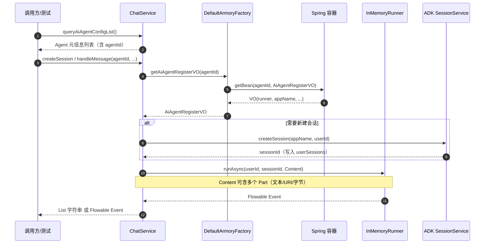

# 会话服务接口实现（service）学习笔记

> 对应课程：第 2-17 节 · 会话服务接口实现-service  
> 工程分支：`2-17-agent-chatService`  
> 对照学习项目分支：`2-17-chat-service`

---

> 学习笔记写法约定见工作台：`D:\javaproject\docs\学习笔记撰写约定.md`（结构：流程理解 + UML → 细聊 / 踩坑 / 拓展）

---

## 一、流程理解（总览）

前面章节已完成智能体装配，并以 `agentId` 把 `AiAgentRegisterVO`（含 `InMemoryRunner`）注册进 Spring。  
本节在 **domain** 层提供标准会话 Service：列智能体、建会话、同步/流式发消息、多模态命令；HTTP（trigger）留给后续。

1. **调用方先知道有哪些 Agent**  
   入口：`IChatService.queryAiAgentConfigList()` → `ChatService` 读 `AiAgentAutoConfigProperties.getTables()`，收集每张配置表上的 `Agent` 元信息（含 `agentId`）。  
   后续建会话 / 发消息都必须带这个 `agentId`。

2. **按 agentId 取出已装配能力**  
   `DefaultArmoryFactory.getAiAgentRegisterVO(agentId)` 内部是 `applicationContext.getBean(agentId, AiAgentRegisterVO.class)`（装配链 `RunnerNode` 注册的结果）。拿不到则抛 `ResponseCode.E0001`。

3. **创建或复用 Session**  
   入口：`ChatService.createSession(agentId, userId)`。用 Runner 的 `sessionService().createSession(appName, userId)`；`userSessions.computeIfAbsent(userId, …)` 按用户缓存 `sessionId`，同用户连续对话复用上下文。

4. **同步处理纯文本**  
   - `handleMessage(agentId, userId, message)`：内部先 `createSession`，再转带 `sessionId` 的重载。  
   - `handleMessage(agentId, userId, sessionId, message)`：`Content.fromParts(Part.fromText)` → `runner.runAsync` → `blockingForEach` 收集各 Event 的 `stringifyContent()` 成 `List<String>`。

5. **流式处理**  
   `handleMessageStream(...)`：同样组文本 Content，但直接返回 `Flowable<Event>`，由调用方订阅。

6. **多模态命令**  
   入口：`handleMessage(ChatCommandEntity)`。把 `texts` / `files` / `inlineDatas` 转成 `Part.fromText` / `fromUri` / `fromBytes`，拼成一条 `role=user` 的 `Content`，再 `runAsync` 并阻塞收集结果。  
   验证：`ChatServiceTest`（纯文本 + `classpath:file/dog.png` 识图）。

一句话：**装配产物按 agentId 取 Runner；会话层负责 Session 与 Content/Part，把「能对话」收成可复用的领域服务。**

### 时序图（UML）



**文本版（对照上面编号）：**

```text
调用方
  ① queryAiAgentConfigList → 拿到可选 agentId
ChatService
  ② getAiAgentRegisterVO(agentId) → Spring 取装配结果
  ③ createSession：ADK 建 Session，按 userId 缓存
  ④/⑤ runAsync：纯文本同步收集 或 流式返回
  ⑥ ChatCommandEntity → 多 Part Content → runAsync
```

---

## 二、学习内容与代码对应

| 能力 | 入口 | 要点 |
|------|------|------|
| 接口 | `IChatService` | 列表 / 建会话 / 三套 handleMessage + Stream |
| 实现 | `ChatService`（`@Service`） | 必须加 `@Service`，否则测试注入不到 |
| 命令对象 | `ChatCommandEntity` | 路由三字段 + 三种内容 List；对齐 ADK Part |
| 取装配结果 | `DefaultArmoryFactory#getAiAgentRegisterVO` | 对 Spring 的薄封装，会话层不直接摸容器 |
| 配置目录 | `AiAgentAutoConfigProperties#getTables` | 列表用配置元数据，不用装配期 `agentGroup`（已随 DynamicContext 丢弃） |
| 错误码 | `ResponseCode.E0001` | 智能体 ID 不存在 |
| 测试 | `ChatServiceTest` | `test_handleMessage_01`、`test_handleMessage_04_withImage` |
| 资源 | `app/.../resources/file/dog.png` | 多模态测图 |

**与 ADK 参数对应：** `userId` / `sessionId` / `Content(Part…)` 是 ADK 原生概念；`agentId` 是脚手架选型键，ADK 只认已绑在 Runner 上的 Agent。

---

## 三、踩坑注意点

1. **忘记 `@Service`**：`NoSuchBeanDefinitionException: IChatService`——装配成功也不妨碍测例在依赖注入阶段失败。  
2. **测例 agentId 与 YAML 不一致**：当前若只装配了 `100003`，测 `100001` 会取不到 Bean。  
3. **`blockingForEach` 收集的是全部 Event 文本**，不一定只有最终答案；要最终回复可过滤 `event.finalResponse()`。  
4. **`userSessions` 仅按 userId 缓存**：多 agent、多端同用户时可能互相覆盖，生产需扩展缓存键（如 `agentId + userId`）。  
5. **列表查 `getTables()` 不是 `agentGroup`**：`agentGroup` 是装配草稿纸（按 name 暂存实例），会话运行时拿不到。

---

## 四、拓展知识

- **下一层**：trigger/HTTP 把本 Service 对外暴露（课程「复杂作业」/后续章节）。  
- **调度 Agent**：可用 `queryAiAgentConfigList` 的描述做 Router，由模型选 `agentId` 再调本 Service。  
- **Part 归属**：`com.google.genai.types.Part`（Gen AI SDK），还支持 functionCall / functionResponse 等；ADK 会话与工具协议都建立在 Content/Part 上。  
- **深挖路径**：`runAsync` → Event → Content → Part；对照 `adk-java` 的 llmflows 与 `java-genai` 源码。
