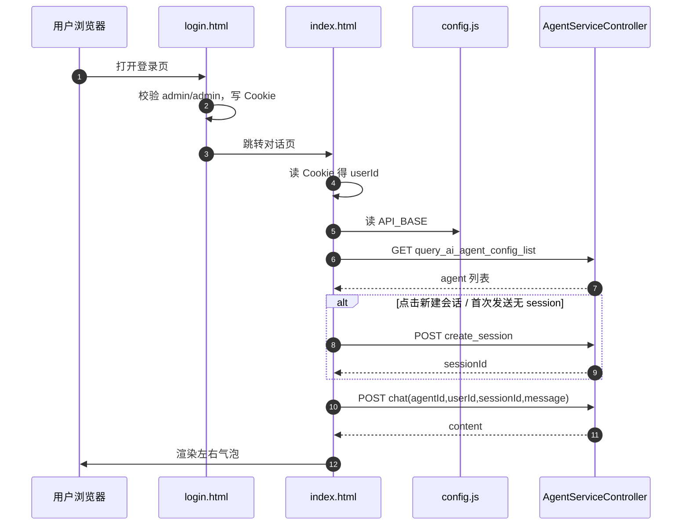

# 第 2-19 节：会话服务接口对接 UI · 设计文档

> 对应课程：第 2-19 节 · 会话服务接口对接-ui  
> 工程分支：`2-19-chat-ui`  
> 对照：学习项目 `ai-agent-scaffold-lite` 分支 `2-19-chat-ui`（只读参考）  
> 落地目录：`docs/dev-ops/nginx/html/`  
> 后端入口：`AgentServiceController`（`/api/v1/`，端口 `8091`）

本文是**前端开发说明书**：按本文实现即可，无需再翻课程 HTML。  
实现文件内会对关键逻辑加中文注释，方便前端不熟的同学对照。

---

## 一、流程理解（总览）

1. **打开登录页** `login.html`  
   演示账号 `admin` / `admin`。校验通过后，把 `{ user, ts }` 写入浏览器 Cookie：`ai_agent_login`，再跳转 `index.html`。

2. **进入对话页** `index.html`  
   先读 Cookie；没有 `user` 就退回登录页。`user` 即后续接口的 `userId`。

3. **读前端配置** `js/config.js`  
   取 `window.APP_CONFIG.API_BASE`（默认 `http://127.0.0.1:8091`），拼出完整接口地址。

4. **加载智能体列表**  
   `GET /api/v1/query_ai_agent_config_list` → 填充下拉框（**只展示 `agentName`**，值为 `agentId`，不拼描述）。失败则弹出「服务端不可用」遮罩。

5. **准备会话**  
   - 侧栏点「新建会话」→ 清空主区，等待首次发送时建 session（或立刻 create，实现以代码为准）  
   - 首次点「发送」且尚无 `sessionId` → 自动 `POST create_session`  
   - 之后同一会话复用 `sessionId`  
   - 切换智能体 → **清空**当前 `sessionId`，避免串会话  
   - 侧栏历史：用 `localStorage` 存本机会话摘要（后端本节无历史列表接口）

6. **发送消息**  
   `POST /api/v1/chat`，body：`agentId + userId + sessionId + message`。  
   页面气泡：**用户在右，LLM 在左**（对齐常见产品如 Kimi）。

一句话：**演示登录只解决 userId；真正能力在三个 `/api/v1` 接口；sessionId 由前端保管并按规则复用。**

### 时序图



**文本版：**

```text
① login → Cookie(userId)
② index 校验 Cookie
③ 读 API_BASE
④ GET 智能体列表
⑤ 新建或首次发送 → POST create_session
⑥ POST chat → 渲染气泡（同 session 复用）
```

---

## 二、目录与文件职责

```text
docs/dev-ops/nginx/html/
├── login.html          # 登录页（演示鉴权 + Cookie）
├── index.html          # 对话页（列表 / 会话 / 发消息）
├── js/
│   └── config.js       # 仅配置 API_BASE，方便改端口
└── images/
    └── studio-mark.svg # 登录页品牌插画（自有风格，非课程拷贝）
```

| 文件 | 职责 |
|------|------|
| `config.js` | 暴露 `window.APP_CONFIG.API_BASE` |
| `login.html` | 演示登录、写/清 Cookie、已登录直达对话页 |
| `index.html` | 鉴权门禁、拉列表、会话状态机、chat、不可用遮罩 |
| `studio-mark.svg` | 登录页左侧视觉锚点 |

本工程暂无强制 nginx；可用浏览器打开，或用任意静态服务器挂该目录。后端需已启动且允许跨域（控制器已 `@CrossOrigin(origins = "*")`）。

---

## 三、接口契约（前端必须遵守）

统一包装：`{ code, info, data }`，成功 `code === "0000"`。

### 3.1 查询智能体列表

- **GET** `/api/v1/query_ai_agent_config_list`
- 无请求体
- `data[]`：`agentId` / `agentName` / `agentDesc`（前端下拉**只用 name**，desc 可忽略）
- 时机：对话页启动、遮罩「重试」

### 3.2 创建会话

- **POST** `/api/v1/create_session`
- `Content-Type: application/json`
- body：`{ "agentId": "...", "userId": "admin" }`
- `data.sessionId`：字符串
- 时机：点「新建会话」；或发送时 `currentSessionId` 为空

### 3.3 同步对话

- **POST** `/api/v1/chat`
- body：`{ agentId, userId, sessionId, message }`
- `data.content`：助手回复文本
- 本节**不接** `chat_stream`（可作为后续增强）

---

## 四、页面状态与交互规则

### 4.1 Cookie

| 项 | 值 |
|----|-----|
| 名称 | `ai_agent_login` |
| 内容 | JSON：`{"user":"admin","ts":<毫秒时间戳>}` |
| 有效期 | 建议 7 天（`Max-Age`） |
| Path | `/`，`SameSite=Lax` |

- 登录成功写入；退出删除。  
- 仅演示用途，非真实后端鉴权。

### 4.2 对话页内存状态

| 变量 | 含义 |
|------|------|
| `userId` | 来自 Cookie |
| `apiBase` | 来自 config |
| `currentSessionId` | 当前会话；空表示尚未创建 |
| 下拉框选中值 | 当前 `agentId` |

规则：

1. **新建会话**：有 `agentId` 才请求；成功后写入 `currentSessionId`，可清空消息区或保留历史（实现采用：清空消息区，提示「新会话已创建」，避免旧气泡与新 session 混淆）。  
2. **发送**：校验 agent + 非空 message；无 session 则先 create；再 chat。  
3. **切换智能体**：`currentSessionId = ""`，侧栏会话展示为「未创建」。  
4. **记住上次智能体**（可选体验）：`localStorage.ai_agent_last_agent`。

### 4.3 气泡约定（产品布局，按需求调整）

- 用户：右侧（`user`），浅灰圆角气泡  
- 智能体：左侧（`agent`），偏文档流排版、轻量或不加重框  
- 文本需 HTML 转义，防 XSS；用 `white-space: pre-wrap` 保留换行。

### 4.4 服务端不可用

下列错误视为后端不可达：`Failed to fetch` / `NetworkError` / `Load failed` / 含 `CORS` 等。

遮罩内容需包含：

- 提示先启动后端  
- 提示检查 `docs/dev-ops/nginx/html/js/config.js` 的 `API_BASE`  
- 「我已启动，重试」→ 重新 `loadAgents`

业务错误（`code !== "0000"`）用状态栏/气泡提示即可，不必一律弹遮罩。

---

## 五、视觉设计（Kimi 式极简双栏）

参考主流对话产品（如 Kimi）的信息架构，做自有品牌实现，不抄像素。

| 维度 | 约定 |
|------|------|
| 气质 | 白底、大留白、细线、轻圆角；安静高级 |
| 侧栏底 | 浅灰 `#F5F5F5` |
| 主区底 | 纯白 `#FFFFFF` |
| 主文字 | 近黑 `#1A1A1A`；次要文字中灰 |
| 强调 | 单一小蓝点/焦点色（如 `#2F6BFF`），忌紫霓虹大渐变 |
| 字体 | 干净无衬线（`IBM Plex Sans` + 中文回退） |
| 布局·对话 | **左固定侧栏**（Logo / 新建 / 历史 / 用户）+ **右主区**（标题 / 消息流 / 底部悬浮输入） |
| 输入框 | 底部居中悬浮大圆角；内含智能体下拉（仅名称）+ 发送 |
| 气泡 | 用户右对齐浅灰泡；助手左对齐近正文排版 |
| 动效 | 侧栏折叠、消息淡入、遮罩（克制） |

品牌文案用自有工程口径（Chaney Agent），不照搬学习项目署名。

---

## 六、实现清单（开发顺序）

1. [x] `js/config.js`  
2. [x] `images/studio-mark.svg`  
3. [x] `login.html`（含 Cookie 工具函数 + 演示登录）  
4. [x] `index.html` 结构与样式  
5. [x] `index.html`：门禁、拉列表、遮罩  
6. [x] `index.html`：createSession / chat / 会话复用 / 新建按钮  
7. [x] 注释：每个关键函数上方用中文说明「干什么、对应哪个接口」  
8. [ ] 联调：启动 Spring Boot → 打开 login → 列表 → 新建 → 多轮对话 → 切 Agent 再聊

---

## 七、联调与自测

1. 后端 `8091` 已启动，至少有一个已装配智能体。  
2. `API_BASE` 与端口一致（注意 `http` 而非误写成 `https`）。  
3. 登录 admin/admin → 对话页显示 userId。  
4. 下拉能看到智能体；停后端应出遮罩，「重试」可恢复。  
5. 同一 session 下第二问应能带上上下文（依赖后端 Session）。  
6. 点「新建会话」后上下文应重新开始。  
7. 切换智能体后 session 清空，再发送会新建。

### 常见问题

| 现象 | 排查 |
|------|------|
| 服务端不可用 | 进程 / 端口 / `API_BASE` |
| CORS 报错 | 确认控制器 `@CrossOrigin` |
| create_session 异常 | 必须用 POST + JSON（不要依赖 GET body） |
| Cookie 读不到 | 尽量同源路径打开两页；或用静态服务器而不是混乱的本地路径 |

---

## 八、与学习项目的差异（刻意为之）

| 点 | 学习项目常见做法 | 我的项目 |
|----|------------------|----------|
| 视觉 | 深色霓虹风 | Kimi 式白底双栏极简 |
| 气泡左右 | 用户左 / 助手右 | **用户右 / 助手左** |
| 智能体下拉 | 名称+描述 | **仅名称** |
| 每次发送 | 示例里易每次新建 session | **同会话复用 sessionId** |
| 「新建」 | 文案有、页面未必显眼 | 侧栏「新建会话」+ 历史列表 |
| 流式 | 可不接 | 本节不接 `chat_stream` |

---

## 九、注释约定（写给前端初学者）

- 文件顶部：本页干什么、依赖哪个配置/接口。  
- Cookie / `fetch` / 会话状态机：函数上方 2～4 行中文。  
- 不注释显而易见的 CSS 属性堆砌；只注释「为什么这样写」的关键样式块（如气泡左右、遮罩）。  
- 变量名用可读英文：`currentSessionId`、`apiBase`、`userId`。
