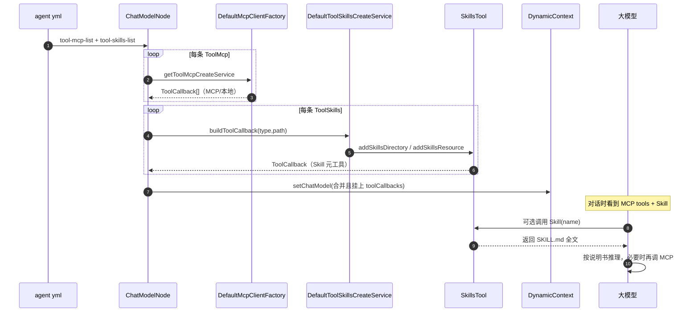

# 增强装配-skills 学习笔记

> 对应课程：第 2-20 节 · 增强装配-skills  
> 工程分支：`2-20-enhance-skill`  
> 对照学习项目分支：`2-20-enhance-armory-skill`

---

> 学习笔记写法约定见工作台：`D:\javaproject\docs\学习笔记撰写约定.md`（结构：流程理解 + UML → 细聊 / 踩坑 / 拓展）

---

## 一、流程理解（总览）

本节在已有 MCP/本地工具装配之上，给 `ChatModelNode` 再挂上 **Skills（技能书）**：YAML 声明路径 → `SkillsTool` 建成 `ToolCallback` → 与 MCP 工具一并挂到 `ChatModel`。Skill 不替代 MCP，而是按需把「说明书」塞进上下文，再指挥模型更准地调 MCP/脚本。

1. **YAML 声明技能来源**  
   入口：`agent/only-one-agent.yml` → `module.chat-model.tool-skills-list`。  
   每条配置：`type`（`resource` / `directory`）+ `path`（如 `agent/skills`）。与 `tool-mcp-list` 并列。

2. **工程内放置技能书**  
   入口：`ai-agent-scaffold-app/src/main/resources/agent/skills/`。  
   每个技能一个目录，核心是 `SKILL.md`（可含 scripts、reference）。样例含 `battle-plan`、`pdf`。

3. **配置对象绑定**  
   入口：`AiAgentConfigTableVO.Module.ChatModel` 增加 `toolSkillsList` / 内部类 `ToolSkills`（`type`、`path`）。Spring 把 YAML 绑定进 VO。

4. **ChatModelNode 在 MCP 之后装配 Skills**  
   入口：`ChatModelNode#doApply`。先按 `tool-mcp-list` 工厂产出 MCP/本地 `ToolCallback`；再遍历 `toolSkillsList`，调用 `ToolSkillsCreateService#buildToolCallback`，`addAll` 进同一列表。

5. **Skills 装配服务按 type 构建**  
   入口：`DefaultToolSkillsCreateService#buildToolCallback`。  
   - `directory` → `SkillsTool.builder().addSkillsDirectory(path)`  
   - `resource` → `SkillsTool.builder().addSkillsResource(new ClassPathResource(path))`  
   依赖：`org.springaicommunity:spring-ai-agent-utils:0.4.2`。

6. **挂到 ChatModel 并进入运行时**  
   `OpenAiChatModel` + 汇总后的 `toolCallbacks` 写入 `DynamicContext`，后续 Agent/Runner 对话时，模型可先调 `Skill` 元工具加载技能全文，再按需调 MCP 等。

一句话：**MCP 是「干活的服务工具」，Skills 是「可按需加载的增强说明书」；二者都变成 `ToolCallback`，由模型按工具描述选择调用。**

### 时序图（UML）



**文本版（对照上面编号）：**

```text
① yml 声明 tool-skills-list（resource/directory + path）
② resources 下放 agent/skills/*/SKILL.md
③ VO 增加 ToolSkills / toolSkillsList
④ ChatModelNode：MCP 装配完再装 Skills
⑤ DefaultToolSkillsCreateService → SkillsTool → ToolCallback
⑥ 挂 ChatModel；运行时先加载技能书，再可调 MCP
```

---

## 二、学习内容与代码对应

| 能力点 | 我的项目落点 |
|--------|----------------|
| 依赖 | 根 `pom.xml` BOM/版本管理 + `ai-agent-scaffold-domain/pom.xml` 引入 `spring-ai-agent-utils` |
| 配置模型 | `AiAgentConfigTableVO.ChatModel.ToolSkills`、`toolSkillsList` |
| 装配接口 | `ToolSkillsCreateService` |
| 装配实现 | `matter/skills/impl/DefaultToolSkillsCreateService` |
| 挂载节点 | `ChatModelNode#doApply`（MCP 循环之后） |
| 技能资源 | `app/.../resources/agent/skills/` |
| YAML | `only-one-agent.yml` → `tool-skills-list`（`type: resource` / `path: agent/skills`） |
| 单功能验证 | `test/.../tool/skills/SpringAiToolTest`（main，直接测 `SkillsTool`） |
| 智能体验证 | `ChatServiceTest#test_handleMessage_01`（问「你具备哪些skill技能」） |

**Skill vs MCP（同为 ToolCallback）：**

| | MCP | Skills |
|--|--|--|
| Provider 典型产出 | `listTools()` → 多个 `SyncMcpToolCallback` | 通常一个 `SkillsTool` 元工具 |
| `call` 时 | MCP `tools/call` 调服务 | 读出 `SKILL.md` 交回模型 |
| 角色 | 执行面 | 指导面（增强 prompt + 步骤） |

---

## 三、踩坑注意点

1. **YAML 漏配则 Skills 不生效**  
   代码有 null/空列表保护；没写 `tool-skills-list` 时装配链照跑，但模型拿不到 Skill 工具。验证智能体前先确认 `100003` 对应 yml 已配置。

2. **本地密钥与 skip-worktree**  
   `only-one-agent.yml` / `test-agent.yml` 本地常有真实 key，需 `skip-worktree`。提交结构变更时：暂解除 → 确认 staged 无真实密钥 → commit → 再 skip-worktree，并保留本地密钥。

3. **Windows 与脚本技能**  
   技能里的 shell/python 脚本可能与 Windows 不兼容，执行失败时多半是脚本环境问题，不是装配失败；可用 AI IDE 改脚本或只验证「能否列出/加载技能」。

4. **勿把测试 main 里的真实 api-key 提交进库**  
   `SpringAiToolTest` 仅本地填 key；仓库保留占位符。

5. **directory / resource 二选一即可**  
   课程案例两套路径指向同一批技能时，测一套足够，避免重复挂载。

---

## 四、拓展知识

1. **Progressive disclosure**  
   `SkillsTool` 启动时只把 name/description 写进工具描述；真正调用 `Skill` 才加载全文，省 token。

2. **可与 Shell/File 工具配合**  
   官方能力集里 Skill 常配合读文件、执行脚本；本脚手架当前重点是「挂上 SkillsTool」，脚本执行依赖模型与后续工具链。

3. **自测清单**  
   - [ ] domain 能编译，依赖 `spring-ai-agent-utils` 已解析  
   - [ ] `agent/skills` 下至少有一份 `SKILL.md`  
   - [ ] `only-one-agent.yml` 有 `tool-skills-list`  
   - [ ] `SpringAiToolTest` 本地填 key 后能回答具备哪些技能  
   - [ ] `ChatServiceTest` 对 agentId=`100003` 提问 skill，回复能体现技能书能力  

4. **作业延伸**  
   简单：完成装配与验证。复杂：自写一本 skills（说明 + 案例 + 脚本），再配进 `tool-skills-list`。
