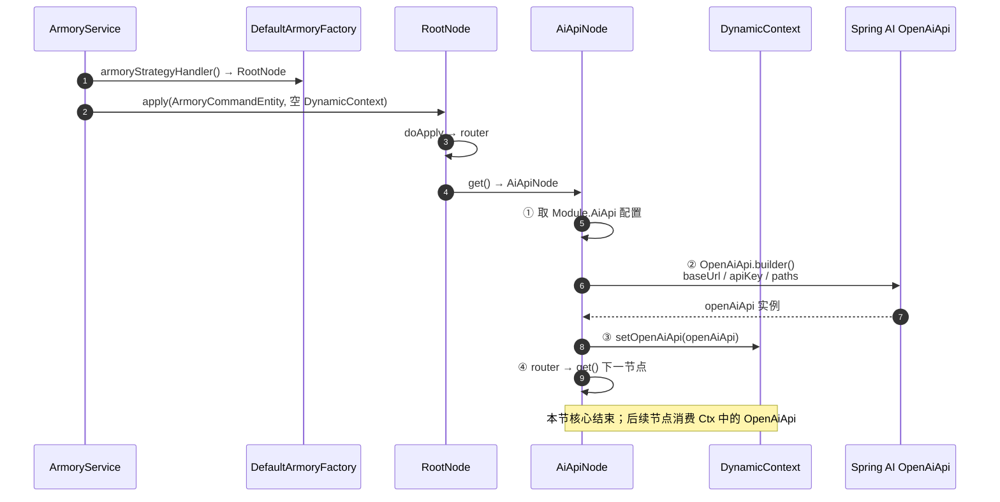

# 装配域节点 AiApiNode 学习笔记

> 对应课程：第 2-5 节 · 装配域节点-AiApiNode  
> 工程分支：`2-5-aiApiNode`（在 `2-4-armory-design` 规则树骨架之上实现第一个装配节点）  
> 学习项目对照：`ai-agent-scaffold-lite` / `2-5-armory-node-ai-api`

---

> 学习笔记写法约定见工作台：`D:\javaproject\docs\学习笔记撰写约定.md`（结构：流程理解 + UML → 细聊 / 踩坑 / 拓展）

---

## 一、流程理解（总览）

本节要做的事只有一件：**在装配责任链里，用配置表把 Spring AI 的 `OpenAiApi` 建好，并塞进上下文**，让后续节点（如 ChatModel）能直接拿来用。不发起真实对话，也不注册 Agent。

1. **装配入口：按配置表逐个跑责任链**  
   `ArmoryService.acceptArmoryAgents(List<AiAgentConfigTableVO>)`：对每张表取 `DefaultArmoryFactory.armoryStrategyHandler()`（即 `RootNode`），构造 `ArmoryCommandEntity` + 空的 `DynamicContext`，调用 `handler.apply(...)`。

2. **RootNode：只负责接到 AiApiNode**  
   `RootNode.doApply` 无业务逻辑，`router` 后由 `get()` 返回 `AiApiNode`。

3. **AiApiNode：读配置 → 构建 OpenAiApi → 写入上下文**  
   `AiApiNode.doApply`：  
   - 从 `requestParameter.getAiAgentConfigTableVO().getModule().getAiApi()` 取 `baseUrl` / `apiKey` / `completionsPath` / `embeddingsPath`；  
   - `OpenAiApi.builder()...build()`；  
   - `dynamicContext.setOpenAiApi(openAiApi)`；  
   - 再 `router` 交给下一节点（当前工程已接到 `ChatModelNode`；课程 2-5 原文里 `get()` 仍返回 `defaultStrategyHandler`，表示本节先只验证本节点）。

4. **上下文承上启下**  
   `DefaultArmoryFactory.DynamicContext` 增加字段 `OpenAiApi openAiApi`。后续节点通过 `dynamicContext.getOpenAiApi()` 取用，不必再读一遍 API 配置。

一句话：**配置表提供连接参数，AiApiNode 负责「建好客户端对象」；真正可复用的产出是上下文里的 `OpenAiApi`。**

### 时序图（UML）

> Cursor / VS Code 默认预览不一定渲染 Mermaid：可装 `Markdown Preview Mermaid Support`，或看 GitHub 预览。下方文本版不依赖插件。



**文本版（对照上面编号）：**

```text
ArmoryService --①--> RootNode.apply(命令实体 + 空上下文)
RootNode --②--> AiApiNode（get 指向下一节点）
AiApiNode --③--> 读 AiAgentConfigTableVO.Module.AiApi
AiApiNode --④--> OpenAiApi.builder() 构建客户端
AiApiNode --⑤--> DynamicContext.setOpenAiApi → router 下一节点
```

---

## 二、学习内容与代码对应

### 2.1 本节改动地图（我的项目）

| 文件 | 角色 |
|------|------|
| `.../armory/node/AiApiNode.java` | 本节主体：构建并写入 `OpenAiApi` |
| `.../armory/factory/DefaultArmoryFactory.java` | `DynamicContext` 增加 `openAiApi` 字段 |
| （已有）`ArmoryService` / `RootNode` / `ArmoryCommandEntity` / `AiAgentConfigTableVO` | 2-4 骨架，本节直接消费 |

学习项目同构，包名为 `cn.bugstack.ai`；我的项目为 `cn.chaney.ai`。

### 2.2 AiApi 配置字段

来源：`AiAgentConfigTableVO.Module.AiApi`

| 字段 | 含义 | 构建时注意 |
|------|------|------------|
| `baseUrl` | 厂商 API 根地址 | 有的已含 `/v1`，有的不含 |
| `apiKey` | 密钥 | 配置里常用占位符，勿把真实密钥写进仓库 |
| `completionsPath` | Chat Completions 路径 | 空则默认 `v1/chat/completions` |
| `embeddingsPath` | Embeddings 路径 | 空则默认 `v1/embeddings` |

代码入口：`AiApiNode.doApply` 中 `OpenAiApi.builder()` 一段。

### 2.3 责任链约定（和 2-4 的关系）

| 概念 | 说明 |
|------|------|
| 入参 `ArmoryCommandEntity` | 携带整张 `AiAgentConfigTableVO`，节点各取所需模块 |
| 上下文 `DynamicContext` | 节点间传递已构建对象（本节写入 `OpenAiApi`） |
| `doApply` | 本节点业务 |
| `get` | 告诉框架下一个 `StrategyHandler` |
| `router` | 框架按 `get` 继续往下走 |

本节重点不是「挂多少个下一跳」，而是：**节点怎么写 + 上下文怎么用**。

### 2.4 与学习项目差异（不影响本节正确性）

- 课程 2-5 分支里 `AiApiNode.get()` 返回 `defaultStrategyHandler`（链在此结束）。  
- 我的项目若已接到 `ChatModelNode`，属于后续课时延伸；**AiApiNode 内构建并 `setOpenAiApi` 的逻辑与课程一致**。

---

## 三、踩坑注意点

1. **`baseUrl` + path 重复 `/v1`**  
   很多兼容 OpenAI 的厂商地址已是 `https://xxx/v1`，若 `completionsPath` 再写 `v1/chat/completions`，会拼成 `/v1/v1/...` 导致 404。配置时二选一：要么 baseUrl 去掉 v1，要么 path 改成相对且不含重复前缀。

2. **默认 path 与 VO 默认值不一致时以 builder 逻辑为准**  
   VO 字段默认值可能是 `/v1/chat/completions`（带前导斜杠），`AiApiNode` 在 blank 时又给了不带斜杠的 `v1/chat/completions`。联调时以最终传入 `OpenAiApi.builder()` 的字符串为准，避免「以为走了默认值其实配置非空」。

3. **上下文必须先 set 再 router**  
   若忘记 `dynamicContext.setOpenAiApi(openAiApi)`，下一节点 `getOpenAiApi()` 为 null，ChatModel 等装配会 NPE。本节产出就是这个字段。

4. **密钥与配置**  
   `apiKey` 应来自本地配置 / 环境变量占位替换，学习笔记与提交中不要写入真实 Key。

---

## 四、拓展知识

### 4.1 为什么先装 Api 再装 ChatModel

`OpenAiApi` 是 HTTP 客户端层（地址、密钥、路径）；`ChatModel`（如 `OpenAiChatModel`）在其上封装对话能力。装配顺序固定为 **Api → Model → Agent…**，和 Spring AI 对象依赖一致。

### 4.2 Spring AI vs LangChain4j（课程作业）

- **简单作业**：弄清节点 `doApply` / `get` / `DynamicContext` 的分工。  
- **复杂作业**：另开分支（如 `xxx-langchain4j`），用 LangChain4j 的 API/Client 构建等价「连接节点」，再在装配链里做兼容。思路相同：读配置 → 建客户端 → 放进上下文。

### 4.3 自测清单

- [ ] `AiApiNode` 能从 `ArmoryCommandEntity` 正确取出 `Module.AiApi`  
- [ ] `DynamicContext` 在经过本节点后 `openAiApi != null`  
- [ ] 给定一组 baseUrl（含/不含 v1）时，最终请求 URL 无重复 path  
- [ ] 日志出现：`Ai Agent 装配操作 - AiApiNode`

---

## 规定说明

本文对应我的项目第 2-5 节跟学内容；后续节点（ChatModel / Agent 等）另开笔记，不在本节展开。
