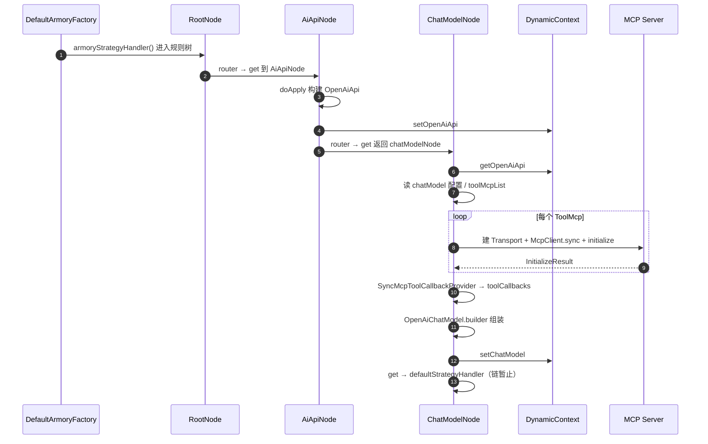

# 装配域节点 ChatModelNode 学习笔记

> 对应课程：第 2-6 节 · 装配域节点-ChatModelNode  
> 工程分支：`2-6-chatModelNode`（在 `2-5-aiApiNode` 的 OpenAiApi 装配之上接对话模型）  
> 对照学习项目分支：`2-6-armory-node-chat-model`

---

> 学习笔记写法约定见工作台：`D:\javaproject\docs\学习笔记撰写约定.md`（结构：流程理解 + UML → 细聊 / 踩坑 / 拓展）

---

## 一、流程理解（总览）

本节把装配链从「造好 `OpenAiApi`」推进到「造好带 MCP 工具的 `ChatModel`」。真正干活的是规则树节点：业务在 `doApply`，下一跳在 `get`。

1. **装配入口仍从根节点进入**  
   `DefaultArmoryFactory.armoryStrategyHandler()` 返回 `RootNode`，后续按 `router` → `get` 往下走（此前已能到 `AiApiNode`）。

2. **AiApiNode：构建 OpenAiApi，并指定下一跳为 ChatModelNode**  
   入口：`AiApiNode.doApply`。按配置 `module.aiApi` 构建 `OpenAiApi`，写入 `DynamicContext.openAiApi`；`get()` 返回注入的 `chatModelNode`（不再是 `defaultStrategyHandler`）。

3. **ChatModelNode：从上下文取 OpenAiApi，按配置建 MCP 客户端**  
   入口：`ChatModelNode.doApply`。读取 `module.chatModel`（模型名、`toolMcpList`），对每个 `ToolMcp` 调用 `createMcpSyncClient`：  
   - **SSE**：`HttpClientSseClientTransport` 连远程 MCP Server；  
   - **Stdio**：本地起进程，用 `StdioClientTransport` 通信。  
   建好后执行 `mcpSyncClient.initialize()` 完成协议握手。

4. **把 MCP 挂到 ChatModel 上，写回上下文**  
   用 `SyncMcpToolCallbackProvider` 把 `List<McpSyncClient>` 转成 Spring AI 的 `toolCallbacks`，再 `OpenAiChatModel.builder()` 组装；结果放入 `DynamicContext.chatModel`。

5. **本节链路暂止**  
   `ChatModelNode.get()` 返回 `defaultStrategyHandler`，后续装配节点以后再接。

一句话：**OpenAiApi 解决「怎么连大模型」；ChatModelNode 解决「模型叫什么、能调哪些 MCP 工具」；上下文把两步产物串起来。**

### 时序图（UML）



**文本版（对照上面编号）：**

```text
Root → AiApiNode
  ① doApply：OpenAiApi → DynamicContext
  ② get：下一跳 ChatModelNode
ChatModelNode
  ③ 取 OpenAiApi + 配置
  ④ 按 SSE/Stdio 建 McpSyncClient 并 initialize
  ⑤ toolCallbacks 挂到 OpenAiChatModel → setChatModel
  ⑥ get：defaultStrategyHandler，本节结束
```

---

## 二、学习内容与代码对应

### 2.1 改动地图（我的项目）

| 文件 | 作用 |
|------|------|
| `.../armory/node/ChatModelNode.java` | 新建：对话模型 + MCP 客户端装配 |
| `.../armory/node/AiApiNode.java` | 注入 `ChatModelNode`，`get()` 指向它 |
| `.../armory/factory/DefaultArmoryFactory.java` | `DynamicContext` 增加 `chatModel` |

包名保持 `cn.chaney.ai`，对照学习项目 `cn.bugstack.ai` 同名节点即可。

### 2.2 ChatModel 组装关键零件

| API / 概念 | 归属 | 含义 |
|------------|------|------|
| `OpenAiApi` | 上节产物 | HTTP 调大模型的客户端 |
| `McpSyncClient` | MCP SDK | 同步 MCP 客户端（连一个 Server） |
| `HttpClientSseClientTransport` | MCP SDK | 远程 HTTP + SSE 传输 |
| `StdioClientTransport` | MCP SDK | 本地子进程 stdin/stdout 传输 |
| `McpClient.sync(...).build()` | MCP SDK | 基于传输层建客户端 |
| `initialize()` | MCP 协议 | 握手；之后才能列工具 / 调工具 |
| `SyncMcpToolCallbackProvider` | Spring AI | MCP Client → Spring AI `ToolCallback` |
| `OpenAiChatModel` | Spring AI | 带默认 options（model、tools）的对话模型 |

### 2.3 配置结构（与 VO 对应）

配置落在 `AiAgentConfigTableVO.Module.ChatModel`：

- `model`：模型名  
- `toolMcpList`：若干 `ToolMcp`，每个里 **sse** 或 **stdio** 二选一  

SSE 常用字段：`baseUri`、`sseEndpoint`、`requestTimeout`。  
Stdio 常用字段：`serverParameters.command/args/env`、`requestTimeout`。

### 2.4 角色再认一次（Client vs Server）

- **本节点站在 MCP Client 侧**：装配时连上别人的工具服务。  
- **MCP Server**：真正暴露 tools 的一方（远程 SSE 服务或本地进程）。  
- 协议统一报文；传输可以是 SSE 或 Stdio。

---

## 三、踩坑注意点

1. **SSE 要两段地址，不是一条完整 URL**  
   `HttpClientSseClientTransport` 要 `baseUri` + `sseEndpoint`。配置若只给整链，需在 `createMcpSyncClient` 里拆开（与 `test_url` 同一思路）。

2. **Stdio 分支务必 `return mcpSyncClient`**  
   学习项目示例里曾漏 return，会误落到「sse and stdio is null」异常；我的项目已补上。

3. **未 `initialize` 不要假定工具可用**  
   握手失败时后面的 `toolCallbacks` / 模型调用都会出问题，日志里先看 `InitializeResult`。

4. **密钥与 MCP api_key 不要写进仓库文档**  
   配置用本地/环境变量；笔记里只写字段名与拆 URL 思路。

5. **本节 `get` 返回 default，不代表 ChatModel 没建好**  
   产物已在 `DynamicContext.chatModel`；只是装配链还没接下一个节点。

---

## 四、拓展知识

### 4.1 运行时工具调用链（装配之后才会发生）

```text
用户提问 → ChatModel（LLM）决定调某 tool
  → Spring AI ToolCallback
    → McpSyncClient 发 tools/call
      → MCP Server 执行并返回
        → 再喂给 LLM 生成最终回答
```

本节只完成「装配阶段把 Client 焊到模型上」；运行时调用是后续对话链路。

### 4.2 复杂作业在学什么

不只是「MCP 是统一传数协议」，而是：

- 谁是 Client、谁是 Server；  
- SSE / Stdio 两种运输方式差在哪；  
- 自己能否写一个最小 Server + Client 跑通一次 call（可参考星球 AI MCP Gateway 第 2 部分）。

### 4.3 自测清单

- [ ] `AiApiNode.get()` 是否返回 `ChatModelNode`  
- [ ] 上下文是否先后有 `openAiApi`、`chatModel`  
- [ ] SSE 整链 URL 能否正确拆成 base + endpoint  
- [ ] Stdio 配置能否 `initialize` 成功并 return  
- [ ] `toolMcpList` 为空或两项都 null 时的异常行为是否符合预期  
